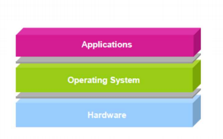
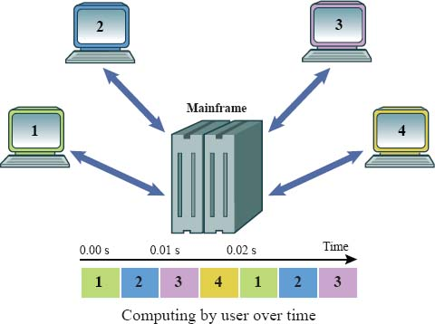
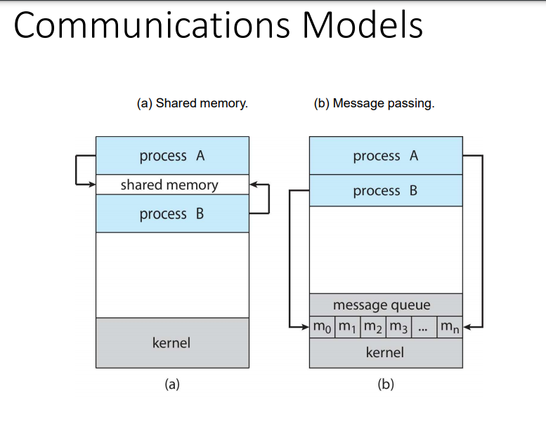

# คำถามก่อนเริ่มเรียน (page 1 pdf1):
## **1. OS คืออะไร ทำไมเราถึงต้องใช้งานมัน**

- คือตัวกลางระหว่าง Application และ Hardware ,
OS ทำให้หลายๆ อย่างเป็น Abstraction หรือเห็นภาพมากขึ้น เช่นการควบคุม Drivers ,IO Device หรือควบคุมไฟล์ในเครื่อง,
OS ยังเป็นตัวที่ควบคุมจัดการพื้นที่หน่วยความจำ,การประมวลผลข้อมูล ให้แก่โปรแกรมที่ต้องการมัน 

## **2. OS platform ขึ้นอยู่กับ Hardware เช่น CPU หรือไม่**
- ขึ้นอยู่กับ CPU ด้วย เพราะ OS บาง OS ไม่สามารถทำงานบน CPU ที่ไม่ได้กำหนดมาได้ เช่น window ไม่สามารถทำงานบนตระกูล ARM ได้

## **3. ทำไม OS บางตัว เช่น Linux ถึงสามาถใช้ CPU Architectures ที่แตกต่างกัน InterX86,ARM**
- ขึ้นอยู่กับ OS ว่าจะทำมาเพื่อ Compatible กับ CPU นั้นๆ หรือเปล่า 

## **4. การทำงานของ Apllication Program ขึ้นอยู่กับ OS หรือ Architecture หรือไม่**

- โปรแกรมบน X86 สามารถทำงานบนทุก OS ของ X86 หรือไม่ 
- ตอบ ไม่ เพราะ 
1) แต่ละ OS จะใช้ Binary Executeable Format ต่างกัน เช่นของ window จะใช้ PE(Portable Execute) ที่เป็นนามสกุล .exe หรือของ linux จะใช้ ELF 
2) แต่ละ OS ก็จะมี Application binry interface ที่ไม่เหมือนกัน แต่ละ OS จะมีชุดคำสั่งที่เป็น binary ที่ส่วนของโปรแกรมแต่ละโปรแกรมจะต้องนำส่วนนี้ไปใช้ ตรงส่วนนี้ในแต่ละ OS ก็ไม่เหมือนกัน เช่น ชุดคำสั่งการอ่านไฟล์จาก memory ของ window อาจจะเป็นคนละตัวกับ linux ก็ได้ 

- โปรแกรมบน Linux สามารถทำงานบน Architecture  ต่างกัน แต่ OS เดียวกันได้หรือไม่
- ตอบ มีทั้งได้และไม่ได้ 

-ส่วนที่ได้ คือ ส่วนที่ยังไม่ได้ Compile หรือตัว Source Code ที่เรามา Compile เองที่ตัว OS จะสามารถทำงานได้ โดย OS จะเป็นคนจัดการเรื่อง Interface ที่ติดต่อกับ Architecture นั้นๆ เอง

-ส่วนที่ไม่ได้ คือ ส่วนที่ Compile มาเป็น Executeable File แล้ว จะมี Binary file ที่แตกต่างกันไปในแต่ละ CPU ตัวติดตั้งของโปรแกรมต่างๆ จึงต้องมีตัวระบุ CPU ระบุไว้ในแต่ละไฟล์นั้นๆ 

## **5. ใน OS แบบมีผู้ใช้หลายคน OS ทำงานยังไงในการสลับงานแต่ละ user นั้นๆ**

- Multi-user OS design มาเพื่อมีหหลาย terminals แต่เชื่อมต่อที่ Mainframe เดียวกัน (เพราะ cpu ในหลังๆ มี microprocessors เยอะ) ซึ่งจะมีการจัดสรรเวลาให้แต่ละการทำงานของ User ดังภาพ

## **6. เมื่อแต่ละ User รันโปรแกรมพร้อมกัน OS จัดสรรเวลายังไง**

ตอบ แล้วแต่ระบบงาน ซึ่งจะแบ่งเป็น 3 ระบบใหญ่ๆ คือ
- Batch Systems (เช่น ระบบจ่ายเงิน คิดเงินต่างๆ ) ระบบนี้จะต้องการรองรับงานได้เยอะที่สุด และใช้ประโยชน์จาก CPU สูงสุด
- Interactive Systems (เช่น คอมพิวเตอร์ในชีวิตประจำวัน) จะต้องการเวลาที่ตอบสนองเร็วสุด
- Real-Time System (เช่น การทำงานบนเครื่องบิน) ระบบนี้จะต้องใช้ความสำคัญ (Priority) มากสุด ยกตัวอย่างเช่น บนเครื่องบิน การควบคุมแต่ละ Flight จะเข้มงดจึงต้องเน้น Priority มากที่สุด

และแต่ละ ระบบมีอัลการิทึมของตัวเองดังนี้
- Batch Systems มี First Come First Serve,Short Job First
- Interactive Systems มี Priority Scheduling,Round Robin ,Multi-Quere
- Realtime Systems Earliest Deadline First Scheduling

## **7.แต่ละ Application ที่อยู่ใน Memory เพราะอะไรถึงจะมั่นใจได้ว่า location address นั้นๆ ไม่ได้ถูกครอบครองโดย Application อื่น**

แต่ละ Process ที่อยู่ใน memory จะมี Address space เป็นของตัวเอง ที่ไม่ขึ้นอยู่กับ Process อื่นเลย 
- เช่น Address ที่ 28 ของโปรแกรมนี้ กับ Address ที่ 28 ของโปรแกรมอื่นจะชี้ไปที่ Physical Address คนละที่กัน
- โดยมี Register พิเศษ 2 ตัวที่คอยควบคุม location ของแต่ละโปรแกรม คือ Register ที่คอยเก็บค่า Base และ Limit นั่นเอง 
- แต่ละโปรแกรมใน Physical Address จะมีค่า Base และ Limit ของตัวเอง โดยที่ Address ของโปรแกรมจะไม่มีทางเกินเลยไปจาก Limit Address ได้
โดย CPU จะเป็นส่วนที่ตัวสอบไม่ให้แต่ละ Process เกินขอบเขตของ Base และ Limit register ของ Process นั้นๆ ทำให้รู้ว่าเป็นของ Application นั้นๆ นั่งเอง

## **8. Application มีวิธีที่สามารถใช้ Resource เช่น libraries ร่วมกันได้หรือไม่**
 
Process ในระบบอาจจะ Independent หรือ Cooperating กันก็ได้ ซึ่งการ Cooperating กัน จะทำให้ Process นั้นส่งผล หรือถูกส่งผลกับ Process อื่นๆ ก็ได้ ซึ่ง Cooperating Process จะต้องการ Inter-process Communication(IPC) 

ซึ่ง IPC ที 2 โมเดลหลักๆ คือ 
- Shared memory
- Message passing

**Shared Memory**
- พื้นที่ของ memory ที่ share กันระหว่าง Process ที่ต้องการจะ Communicate ด้วย
- การติดต่อสื่อสารกันจะถูกควบคุมภายใต้ Process ไม่ใช่ OS

**Message Passing**
- เป็นการสื่อสารกันโดยไม่มีการใช้ Variables ร่วมกัน 
- มี Operation 2 ตัวสำคัญ คือ send(msg) และ receive(msg)
- ซึ่งขนาดของ message ที่จะส่ง โปรแกรมเมอร์จะกำหนดเอง หรือให้ System-level จัดการเองก็ได้

